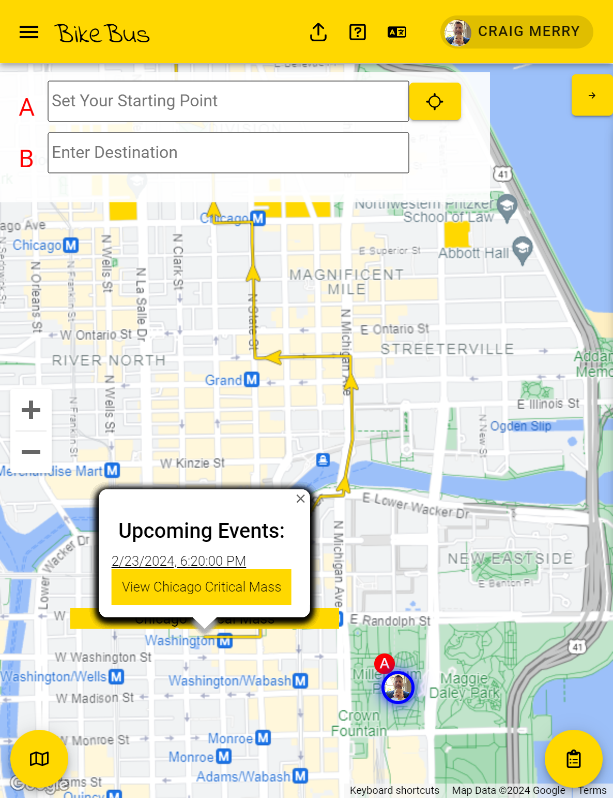
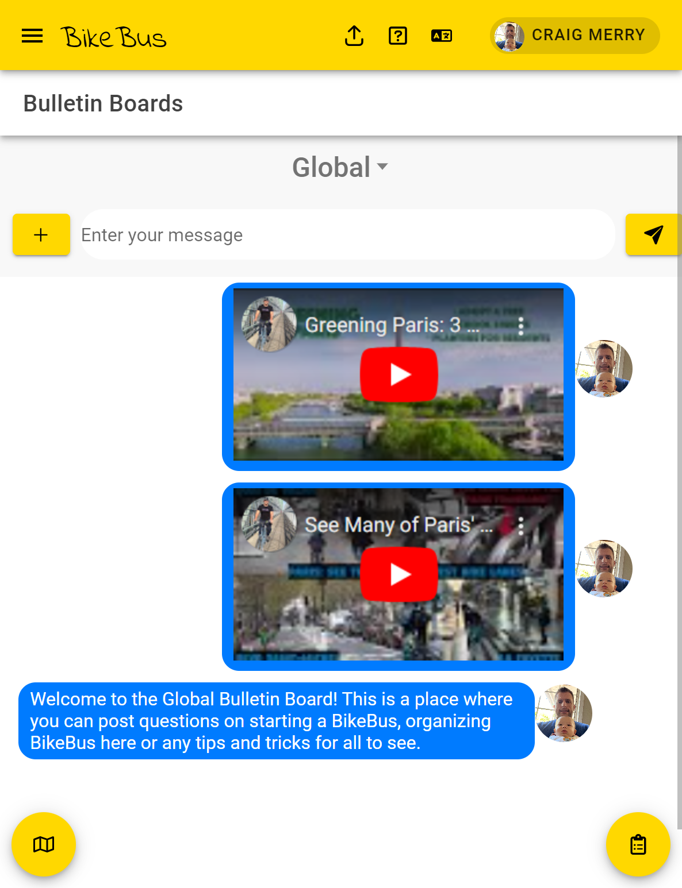
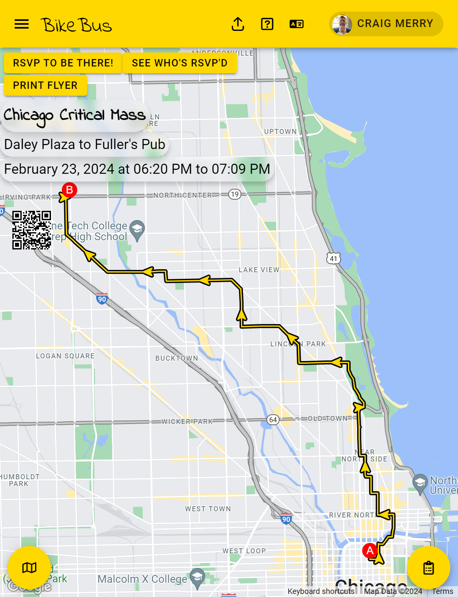
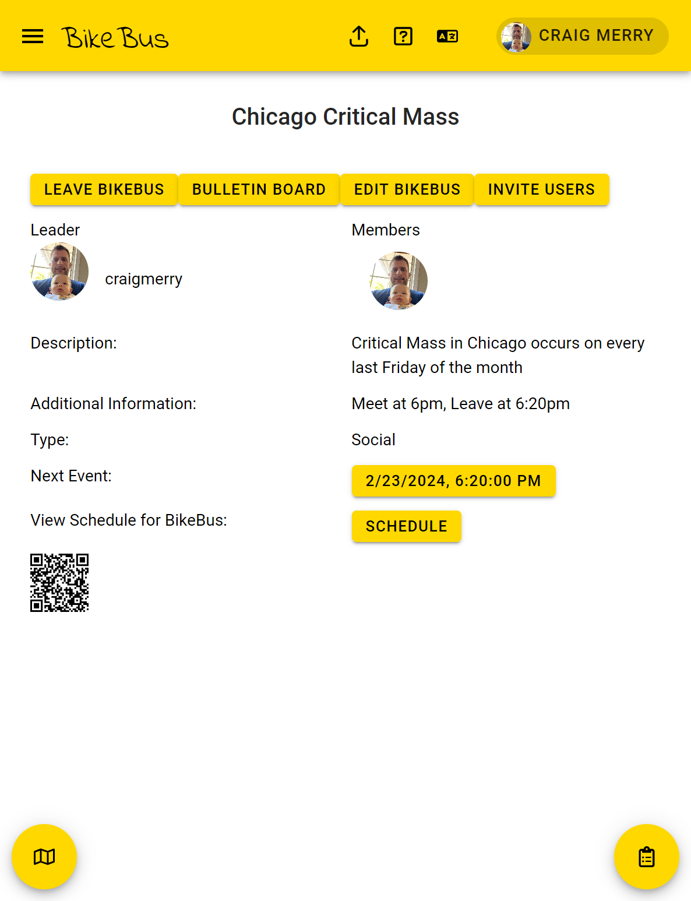

# BikeBus

The [BikeBus app](https://bikebus.app) is software meant to be an one-stop shop for all things related to bicycling in a group. This app should be able to create BikeBus routes, events, and groups. It should also be able to send push notifications to users and allow users to send messages to each other. The app should also be able to show a map of the route and allow users to see the route and the BikeBus group in real time.






## Table of Contents

- [BikeBus](#bikebus)
  - [Table of Contents](#table-of-contents)
  - [What](#what)
  - [How](#how)
  - [Who](#who)
  - [Why](#why)
  - [Features](#features)
  - [Contributing](#contributing)
  - [Getting Started](#getting-started)
  - [Pre-requisites](#pre-requisites)
  - [Installing](#installing)
  - [Development Builds](#development-builds)
    - [To deploy to iOS TestFlight](#to-deploy-to-ios-testflight)
    - [To deploy development builds and distribute to Google Play Store](#to-deploy-development-builds-and-distribute-to-google-play-store)
    - [To deploy to Firebase preview channel](#to-deploy-to-firebase-preview-channel)
  - [Production Builds](#production-builds)
  - [To deploy to Web (Firebase production channel)](#to-deploy-to-web-firebase-production-channel)
  - [To deploy for Android](#to-deploy-for-android)
  - [To deploy for iOS](#to-deploy-for-ios)
  - [Authors](#authors)
  - [Acknowledgments](#acknowledgments)
  
## What

BikeBus is a term to describe a group of cyclists that is usually guided by a leader. In the US, this has become a growing activity to help children get to school. This app will help BikeBus leaders create a route, invite new members and allow parents to monitor the BikeBus as it makes it way to school.

This project has always and will be without ads or selling of user data with PII. Anonymous users and anonymized data wherever possible. BikeBus data might be made available to future API to help build safer streets.

The BikeBus User Interface is being developed in the open and we welcome contributions. We are using the GPL-3.0 License. Please see the LICENSE file for more details.

The BikeBus Database (Firebase) is closed and we are not accepting contributions to it at this time. The plan is to safely build a public and private API to access anonymized data in the future.

Other project documentation that is not in this ReadMe are:

- [GitHub Discussions](https://github.com/craigm26/bike-bus/discussions)
- [GitHub Project Roadmap](https://github.com/craigm26/bike-bus/projects?query=is%3Aopen)
- [GitHub Issues](https://github.com/craigm26/bike-bus/issues)
- [GitHub Pull Requests](https://github.com/craigm26/bike-bus/pulls)
- [GitHub Wiki](https://github.com/craigm26/bike-bus/wiki)
- [Google Drive Folder](https://drive.google.com/drive/folders/1-6pKiaPo7Tr8LhZi4tGfG6lsVqIEAzTB?usp=drive_link)
  - [Charter](https://docs.google.com/document/d/1-tZgPCku1pflzEpZY6bn0FC-ty0YGXyIfHJHWLIdnp4/edit?usp=drive_link)
- [Code of Conduct](CODE_OF_CONDUCT.md)
- [Security](SECURITY.md)
- [License](LICENSE)
- [Privacy Policy](PRIVACY_POLICY.md)
- [Terms of Service](TERMS_OF_SERVICE.md)
  
## How

We are using the Ionic Framework to build the app. We are using Firebase for the backend. We are using Google Maps for the mapping and directions. We are using Firebase Hosting for the web app and Firebase Cloud Messaging for the push notifications.

## Who

We are a group of volunteers who are passionate about cycling and safe streets.

Please see the [Contributors](CONTRIBUTORS.md) file for more details.

## Why

We think technology could help make this a smoother, more fun experience while promoting cycling and safer streets with data for policy makers on street design.

## Features

- Create a route, make it a scheduled route and call that a BikeBus group. Invite other or new users to join.
- Map search then allow options to get directions, look for routes or BikeBus groups
- "Bulletin Boards" allow users in a BikeBus or Organization to send messages
- Account page allows users to see their details and change them

## Contributing

How you can help:

  1. Test the [Production app](https://www.bikebus.app) and [report bugs](https://github.com/craigm26/bike-bus/issues)
  2. Suggestions for new features should be added to the [Issues](https://github.com/craigm26/bike-bus/issues) list
  3. Feedback on the [UI/UX](https://github.com/craigm26/bike-bus/issues) is always welcome

We are looking for help with the following:

  1. UI/UX Design
  2. Ironing out bugs
  3. Adding new features
  4. Testing
  5. Documentation
  6. Translations
  7. Accessibility
  8. Security
  9. Performance

## Getting Started

- [We're using Ionic Framework with React to build the app](https://ionicframework.com/docs/react)
- Ionic Serve to preview the build locally
- Then push to Firebase Hosting for production builds

## Pre-requisites

- npm 18.20.0

## Installing

- Open a terminal in VSCode
- Clone the repository
- Run the following command: npm install

## Development Builds

Once you have the app running locally, pick an issue from the [Issues](https://github.com/craigm26/bike-bus/issues) list or create a new one. Then create a branch and start working on the issue. Once you are done, create a pull request and assign a reviewer.

The reviewer will check the code and merge it into the main branch then deploy the app to Firebase Hosting for testing.

Once the app is tested, the reviewer will deploy the app to Firebase Hosting for production.

### To deploy to iOS TestFlight

- ionic build
- npx cap sync
- npx sync ios
- manually add the GoogleService-Info.plist file to the ios/App folder
- manually modify the config.xml file to add the following lines:

```xml
<?xml version='1.0' encoding='utf-8'?>
<widget version="1.0.0" xmlns="http://www.w3.org/ns/widgets" xmlns:cdv="http://cordova.apache.org/ns/1.0">
  <access origin="*" />
  <platform name="ios">
      <resource-file src="GoogleService-Info.plist" />
  </platform>
</widget>
```

1. Open Xcode and select the project
2. Select the target
3. Select the "Signing & Capabilities" tab
4. Select the "All" tab
5. Select the "Signing" section
6. Select the "Team" dropdown and select the team
7. Select the "Signing Certificate" dropdown and select the certificate
8. Select the "Provisioning Profile" dropdown and select the profile
9. Select the "Product" menu
10. Select the "Archive" option
11. Select the "Distribute App" option
12. Select the "App Store Connect" option
13. Select the "Next" button
14. Select the "Upload" button
15. Select the "Next" button
16. Select the "Done" button
17. Go to App Store Connect
18. Select the "TestFlight" tab
19. Select the "Builds" tab
20. Select the build
21. Select the group for testing the build

### To deploy development builds and distribute to Google Play Store

1. Open Android Studio
2. Select the project
3. Select the "Build" menu
4. Select the "Build Bundle(s) / APK(s)" option
5. Select the "Build APK(s)" option
6. Select the "Locate" button
7. Drag the .apk file to the Google Play Console
8. Select the "Create Release" button
9. Select the "Review" button
10. Select the "Start Rollout" button
11. Select the "Confirm" button

### To deploy to Firebase preview channel

- ionic build
- npx cap sync
- npx sync ios
- npx sync android
- firebase hosting:channel:deploy preview

## Production Builds

Production builds will be compiled by Craig Merry and pushed out when tested.

## To deploy to Web (Firebase production channel)

- ionic build --prod
- npx cap sync
- npx sync ios
- npx sync android
- firebase deploy --only hosting:production

## To deploy for Android

- ionic build
- npx cap sync
- npx sync Android
- manually add the google-services.json file to the android/app folder
- clean build in Android Studio
- perform a build in Android Studio - .aab file
- upload to Google Play Store as a new release (production for now)

## To deploy for iOS

- ionic build
- npx cap sync
- npx sync ios
- manually add the GoogleService-Info.plist file to the ios/App folder
- manually modify the config.xml file to add the following lines:

```xml
<?xml version='1.0' encoding='utf-8'?>
<widget version="1.0.0" xmlns="http://www.w3.org/ns/widgets" xmlns:cdv="http://cordova.apache.org/ns/1.0">
  <access origin="*" />
  <platform name="ios">
      <resource-file src="GoogleService-Info.plist" />
  </platform>
</widget>

```

- commit to github

## Authors

- Craig Merry - Initial work - [craigm26](www.twitter.com/craigm26)
- [Contributors](CONTRIBUTORS.md)

## Acknowledgments
